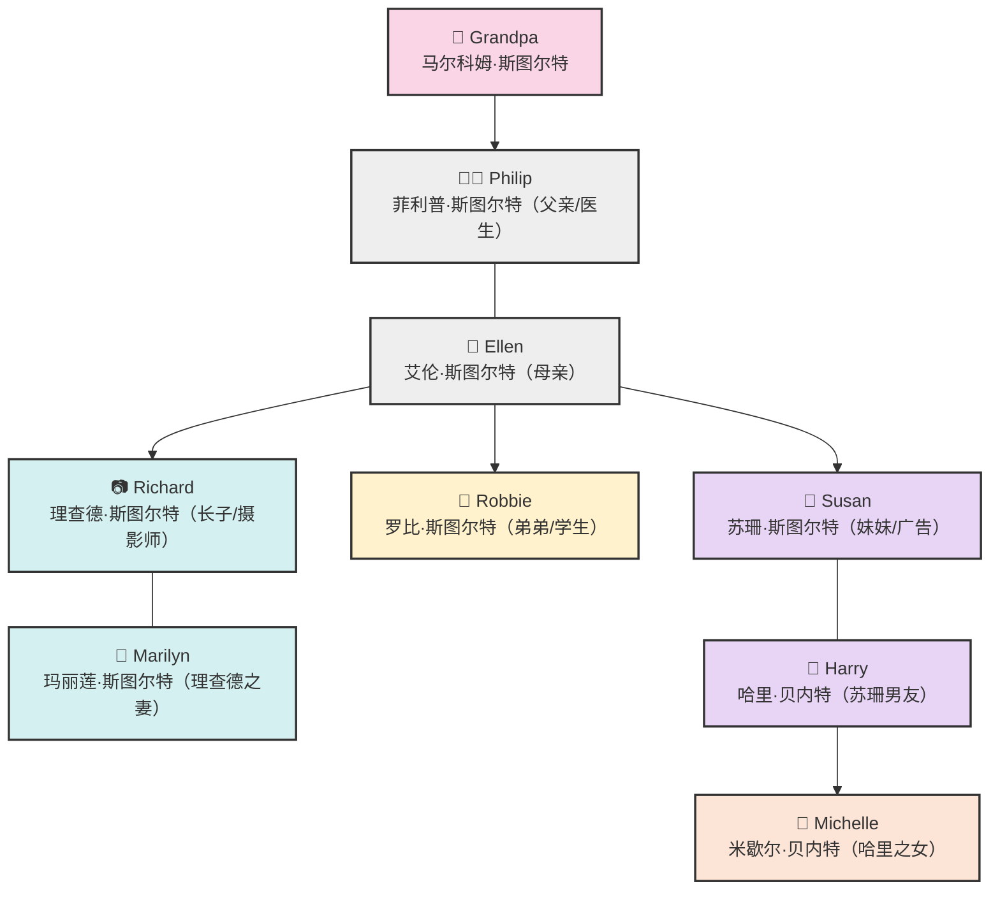

# 1.1 斯图尔特家族成员 — Meet the Stewarts

---

## 📖 剧情概要

《走遍美国》（Family Album U.S.A.）是一部经典的美式英语教学剧，故事围绕纽约的斯图尔特家族展开。第一幕从清晨开始——理查德·斯图尔特（Richard Stewart）是一位自由摄影师，他正和妻子玛丽莲（Marilyn）在家中的厨房里聊天。理查德为今天的拍摄工作做准备，玛丽莲则为他熨烫衬衫。斯图尔特家是个热闹的大家庭：父亲菲利普是位医生，母亲艾伦是位细心体贴的主妇，弟弟罗比还在上高中，妹妹苏珊在广告公司工作，还有一位智慧慈祥的祖父（Grandpa）住在一起。

这个家庭温暖、真实、充满活力，展现了当代美国家庭的日常生活、亲情关系和文化价值观。通过他们的故事，学习者不仅能学到地道的英语口语，还能了解美国人的思维方式和生活习惯。

> *"This is the Stewart family. They're a typical American family."*
> 这就是斯图尔特一家。他们是典型的美国式家庭。

---

## 👥 人物表

| 人物 | 英文名 | 年龄/身份 | 角色说明 |
|------|--------|-----------|----------|
| 理查德·斯图尔特 | **Richard Stewart** | 30岁左右，摄影师 | 长子，热爱摄影，性格温和细心，正在筹备一本关于美国人的摄影集 |
| 玛丽莲·斯图尔特 | **Marilyn Stewart** | 28岁左右，理查德的妻子 | 温柔体贴，经营自己的服装设计小生意，正在孕育新生命 |
| 菲利普·斯图尔特 | **Dr. Philip Stewart** | 60岁左右，医生 | 父亲，资深牙医，严谨负责，是家庭的支柱 |
| 艾伦·斯图尔特 | **Ellen Stewart** | 58岁左右，母亲 | 母亲，善良热情，把家里打理得井井有条 |
| 罗比·斯图尔特 | **Robbie Stewart** | 17岁，高中生 | 弟弟，阳光帅气的青少年，喜欢运动和音乐 |
| 苏珊·斯图尔特 | **Susan Stewart** | 32岁左右，广告公司主管 | 妹妹，事业成功、独立自信的都市女性 |
| 哈里·贝内特 | **Harry Bennett** | 35岁左右，苏珊的男友 | 性格稳重，经营一家玩具公司，后来与苏珊结婚 |
| 米歇尔·贝内特 | **Michelle Bennett** | 9岁，哈里的女儿 | 聪明可爱的小女孩，父亲再婚后与苏珊相处融洽 |
| 祖父（马尔科姆·斯图尔特） | **Grandpa (Malcolm Stewart)** | 70多岁，退休 | 家族长者，幽默风趣，喜欢钓鱼和园艺，偶尔固执但充满智慧 |

---

## 🌳 人物关系图



**关系说明：**
- 祖父（Grandpa）是菲利普（Philip）的父亲
- 菲利普（Philip）和艾伦（Ellen）是夫妻
- 理查德（Richard）、罗比（Robbie）、苏珊（Susan）是菲利普和艾伦的三个子女
- 玛丽莲（Marilyn）是理查德的妻子
- 哈里（Harry）是苏珊的男友（后成为丈夫）
- 米歇尔（Michelle）是哈里的女儿

---

## 📚 核心词汇 — 家庭成员篇（10+个）

以下每个词汇均配有 **国际音标（IPA）**、**中文释义** 和 **剧中例句**。

### 1. family /ˈfæməli/ 家庭，家人
> **例句：** This is the **family** album.  
> 这是家庭相册。

### 2. father /ˈfɑːðər/ 父亲
> **例句：** My **father** is a doctor.  
> 我的父亲是一名医生。

### 3. mother /ˈmʌðər/ 母亲
> **例句：** My **mother** is a wonderful cook.  
> 我母亲是一位很棒的厨师。

### 4. son /sʌn/ 儿子
> **例句：** Richard is the oldest **son** in the family.  
> 理查德是家中长子。

### 5. daughter /ˈdɔːtər/ 女儿
> **例句：** Susan is their only **daughter**.  
> 苏珊是他们唯一的女儿。

### 6. brother /ˈbrʌðər/ 兄弟
> **例句：** Robbie is Richard's younger **brother**.  
> 罗比是理查德的弟弟。

### 7. sister /ˈsɪstər/ 姐妹
> **例句：** Susan is Richard's **sister**.  
> 苏珊是理查德的妹妹。

### 8. husband /ˈhʌzbənd/ 丈夫
> **例句：** Richard is Marilyn's **husband**.  
> 理查德是玛丽莲的丈夫。

### 9. wife /waɪf/ 妻子
> **例句：** Marilyn is Richard's **wife**.  
> 玛丽莲是理查德的妻子。

### 10. grandfather /ˈɡrænfɑːðər/ 祖父，外祖父
> **例句：** **Grandfather** lives with the family.  
> 祖父和这一家人住在一起。

### 11. grandmother /ˈɡrænmʌðər/ 祖母，外祖母
> **例句：** My **grandmother** passed away ten years ago.  
> 我的祖母十年前去世了。

### 12. uncle /ˈʌŋkəl/ 叔叔，伯父，舅舅
> **例句：** Richard is Robbie's **uncle** — wait, no, he's his brother!  
> 理查德是罗比的叔叔——等等，不，他是他哥哥！

### 13. aunt /ænt/ 阿姨，姑妈，伯母
> **例句：** Susan is Michelle's **aunt** after she marries Harry.  
> 苏珊在嫁给哈里后就成了米歇尔的阿姨。

### 14. cousin /ˈkʌzən/ 堂（表）兄弟姐妹
> **例句：** My **cousin** is coming to visit next week.  
> 我的表弟/表妹下周要来看望我们。

### 15. parents /ˈpɛrənts/ 父母（复数）
> **例句：** His **parents** live in New York.  
> 他的父母住在纽约。

### 16. children /ˈtʃɪldrən/ 孩子们（child的复数）
> **例句：** The Stewart **children** are all grown up now.  
> 斯图尔特的孩子们现在都长大了。

### 17. nephew /ˈnɛfjuː/ 侄子，外甥
> **例句：** Robbie is Michelle's **nephew** — actually, no, he's her uncle!  
> 罗比是米歇尔的侄子——不对，他是她叔叔！

> 💡 **注意：** nephew（侄子/外甥）和 uncle（叔叔/舅舅）是相反的关系。你的 uncle 是你的父亲的兄弟或母亲的兄弟，而你是他的 nephew 或 niece（侄女/外甥女）。

---

## 🗣️ 实用表达

### 初次见面与问候

| 英文 | 中文 | 使用场景 |
|------|------|----------|
| Nice to meet you. | 很高兴认识你。 | 初次见面时的标准问候 |
| How do you do? | 你好。 | 正式场合的问候（回答相同） |
| This is my brother, Robbie. | 这是我弟弟，罗比。 | 介绍他人 |
| I'd like you to meet my wife, Marilyn. | 我想让你见见我的妻子，玛丽莲。 | 正式介绍 |
| Pleased to meet you. | 很高兴见到你。 | 友好礼貌的回应 |

### 家庭介绍常用句

> **"This is my family. We're the Stewarts."**  
> 这是我的家人。我们是斯图尔特一家。

> **"He's my father. He's a doctor."**  
> 他是我父亲。他是一名医生。

> **"She's my sister. She works in advertising."**  
> 她是我妹妹。她在广告业工作。

> **"They're my parents. They live in New York."**  
> 他们是我的父母。他们住在纽约。

> **"We're a close family."**  
> 我们是一个关系亲密的家庭。

---

## 📐 语法要点：be动词（am / is / are）

### 1. 什么是be动词？

**be动词** 是英语中最基本、最重要的动词，意为"是"。在一般现在时中，be动词有三种形式：

| 主语 | be动词 | 缩写形式 |
|------|--------|----------|
| I（我） | **am** | I'm |
| He / She / It（他/她/它） | **is** | he's / she's / it's |
| You / We / They（你/你们/我们/他们） | **are** | you're / we're / they're |

### 2. 肯定句结构

> **主语 + be动词 + 其他成分**

| 例句 | 翻译 |
|------|------|
| I **am** Richard Stewart. | 我是理查德·斯图尔特。 |
| He **is** a photographer. | 他是一名摄影师。 |
| She **is** Marilyn. | 她是玛丽莲。 |
| It **is** a photo album. | 这是一本相册。 |
| You **are** Robbie's brother. | 你是罗比的哥哥。 |
| We **are** the Stewarts. | 我们是斯图尔特一家。 |
| They **are** in the kitchen. | 他们在厨房里。 |

### 3. 否定句结构

> **主语 + be动词 + not + 其他成分**

| 例句 | 缩写 | 翻译 |
|------|------|------|
| I **am not** a doctor. | I'm not a doctor. | 我不是医生。 |
| He **is not** my father. | He isn't my father. | 他不是我父亲。 |
| She **is not** at home. | She isn't at home. | 她不在家。 |
| We **are not** married. | We aren't married. | 我们没结婚。 |
| They **are not** here. | They aren't here. | 他们不在这里。 |

### 4. 一般疑问句结构

> **be动词 + 主语 + 其他成分？**

| 问句 | 肯定回答 | 否定回答 | 翻译 |
|------|----------|----------|------|
| **Am** I late? | Yes, you are. | No, you aren't. | 我迟到了吗？ |
| **Is** he Richard? | Yes, he is. | No, he isn't. | 他是理查德吗？ |
| **Is** she your wife? | Yes, she is. | No, she isn't. | 她是你妻子吗？ |
| **Are** you a student? | Yes, I am. | No, I'm not. | 你是学生吗？ |
| **Are** they at home? | Yes, they are. | No, they aren't. | 他们在家吗？ |

> ⚠️ **注意：** 肯定回答中不能使用缩写形式（不能说 Yes, I'm，要说 Yes, I am）。否定回答中缩写可以（No, I'm not 或 No, he isn't）。

### 5. be动词在介绍中的核心作用

在介绍人物时，be动词是必不可少的：

```
You:    I am Richard Stewart.
        I am a photographer.
        This is my family.

Others: He is Richard.
        She is Marilyn.
        They are the Stewarts.
```

---

## 🌎 文化注释

### 1. 美国家庭的"直呼其名"文化

在美国家庭中，子女通常**直接称呼父母的名字**（如"Richard"直接叫"Philip"）并不常见，但孙辈叫祖父"Grandpa"或"Granddad"则很普遍。不过，美国家庭里**父母之间、子女之间**经常直接叫名字，而不是像东方文化中使用"大哥""二姐"等称谓。斯图尔特家中，所有人都称呼祖父为"**Grandpa**"，这是一种亲切又尊重的叫法。

### 2. 美国家庭的独立性

虽然斯图尔特家三代同堂，但在美国这种**多代同堂**的情况并不像中国那样普遍。美国年轻人通常18岁后就会搬出去独立生活。剧中人物选择住在一起更多是剧情需要，展现了温暖的家庭价值观。

### 3. 职业与身份

美国家庭中，人们经常用**职业**来介绍和定义自己："I'm a doctor.""I'm a photographer." 工作身份在美国文化中非常重要。剧中菲利普是医生（doctor），理查德是摄影师（photographer），体现了不同职业在社会中的价值。

### 4. 已婚女性的姓氏

玛丽莲嫁给理查德后，她的全名是 **Marilyn Stewart**（玛丽莲·斯图尔特）。在西方传统中，已婚女性通常会随夫姓，但现代社会中越来越多的女性选择保留自己的婚前姓氏（maiden name）。

### 5. 称呼的亲切形式

美国人在家庭中使用很多昵称和简称：
- **Grandpa** → Grandfather（祖父）
- **Mom / Mom** → Mother（母亲）
- **Dad** → Father（父亲）
- **Robbie** → Robert（罗伯特的昵称）
- **Harry** → Harold或Henry的简称

---

## ✍️ 自测练习

### 练习一：填空（用 am / is / are 填空）

1. I ______ a student.
2. She ______ Marilyn Stewart.
3. They ______ my parents.
4. He ______ a doctor.
5. We ______ the Stewart family.
6. You ______ Richard's brother.
7. It ______ a beautiful photo.
8. This ______ my family album.

### 练习二：翻译成英文

1. 我是理查德·斯图尔特。
2. 她是我妻子。
3. 他们不是医生。
4. 你是一名学生吗？
5. 这是我弟弟，罗比。
6. 祖父和我们住在一起。
7. 苏珊是理查德的妹妹。
8. 我们是斯图尔特一家。

### 练习三：将下列句子改为否定句

1. He is a photographer.
2. She is my sister.
3. They are in the kitchen.
4. I am a doctor.
5. We are at home.

### 练习四：将下列句子改为一般疑问句

1. He is Richard's brother.
2. She is Marilyn's husband. （× 错误句子，请改对）
3. They are from New York.
4. You are a student.
5. This is a family album.

### 练习五：词汇配对 —— 将英文词与正确的中文意思连线

| 英文词 | 中文意思 |
|--------|----------|
| ① husband | A. 女儿 |
| ② daughter | B. 丈夫 |
| ③ cousin | C. 侄子 |
| ④ nephew | D. 祖父 |
| ⑤ grandfather | E. 堂（表）兄弟姐妹 |
| ⑥ aunt | F. 阿姨 |

### 练习六：阅读理解

阅读下面的段落，判断正误（T / F）。

> *"Hi! My name is Richard Stewart. I'm a photographer. This is my wife, Marilyn. She's a fashion designer. My father, Philip, is a doctor. My mother, Ellen, is a housewife. My brother, Robbie, is a high school student. My sister, Susan, works in advertising. And this is my grandfather. We call him Grandpa. We're the Stewarts — a typical American family!"*

1. ( ) Richard is a photographer.
2. ( ) Marilyn is a doctor.
3. ( ) Philip is a doctor.
4. ( ) Robbie is a college student.
5. ( ) Grandpa is Richard's father.
6. ( ) Susan works in advertising.
7. ( ) Ellen is a fashion designer.
8. ( ) The Stewarts are a typical American family.

---

## ✅ 答案

### 练习一：填空

| 题号 | 答案 |
|------|------|
| 1 | **am** |
| 2 | **is** |
| 3 | **are** |
| 4 | **is** |
| 5 | **are** |
| 6 | **are** |
| 7 | **is** |
| 8 | **is** |

### 练习二：翻译成英文

1. I **am** Richard Stewart.
2. She **is** my wife.
3. They **are not** (aren't) doctors.
4. **Are** you a student?
5. This **is** my brother, Robbie.
6. Grandpa lives with us. 或 Grandpa **is** living with us.
7. Susan **is** Richard's sister.
8. We **are** the Stewarts.

### 练习三：改为否定句

1. He **is not** (isn't) a photographer.
2. She **is not** (isn't) my sister.
3. They **are not** (aren't) in the kitchen.
4. I **am not** a doctor.
5. We **are not** (aren't) at home.

### 练习四：改为一般疑问句

1. **Is** he Richard's brother?
2. **Is** he Marilyn's husband?（原句将"she"改为"he"，因为丈夫是男性）
3. **Are** they from New York?
4. **Are** you a student?
5. **Is** this a family album?

### 练习五：词汇配对

① husband — **B** 丈夫
② daughter — **A** 女儿
③ cousin — **E** 堂（表）兄弟姐妹
④ nephew — **C** 侄子
⑤ grandfather — **D** 祖父
⑥ aunt — **F** 阿姨

### 练习六：阅读理解

| 题号 | 答案 |
|------|------|
| 1 | **T** (True) 理查德是摄影师 |
| 2 | **F** (False) 玛丽莲是时尚设计师，不是医生 |
| 3 | **T** (True) 菲利普是医生 |
| 4 | **F** (False) 罗比是高中生（high school student），不是大学生 |
| 5 | **F** (False) 祖父是理查德的祖父（爷爷），不是父亲 |
| 6 | **T** (True) 苏珊在广告业工作 |
| 7 | **F** (False) 艾伦是家庭主妇（housewife），不是时尚设计师 |
| 8 | **T** (True) 斯图尔特一家是典型的美国家庭 |

---

> 📌 **下一节预告：** 1.2 斯图尔特的早晨 — A Morning at the Stewarts'  
> 欢迎继续学习！We **are** the Stewarts, and you **are** part of our family now! 🎉

---

[← 第一篇·人物与场景](part1/README.md) | [1.2 林登街46号 →](part1/sections/1.2.md)
